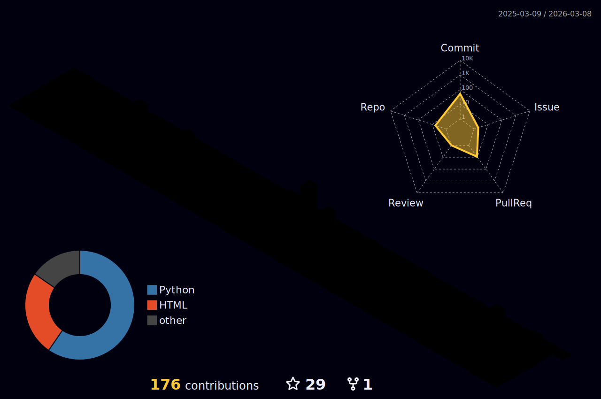
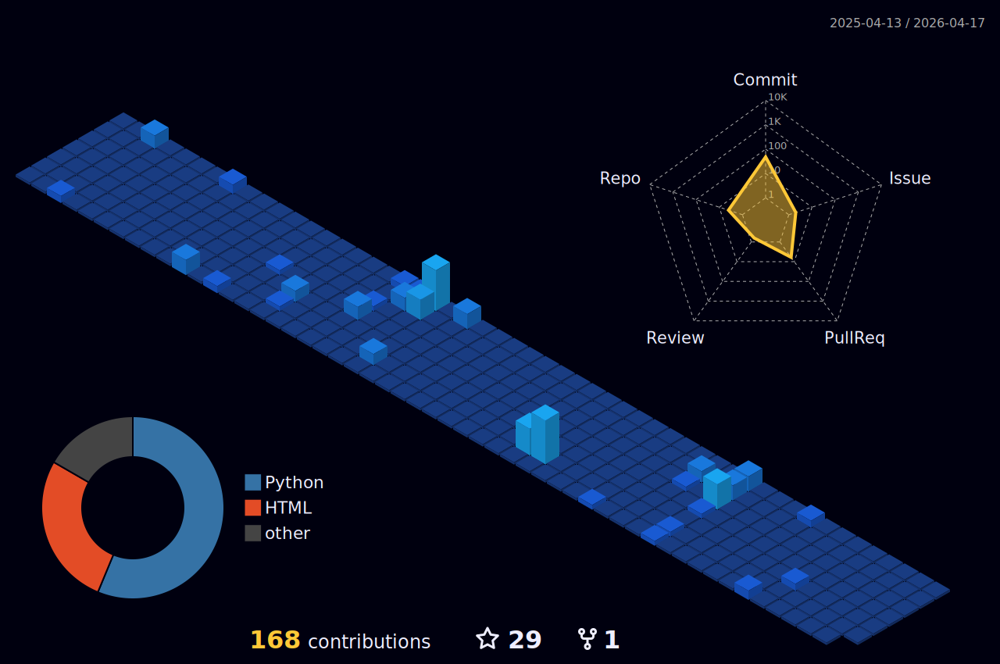
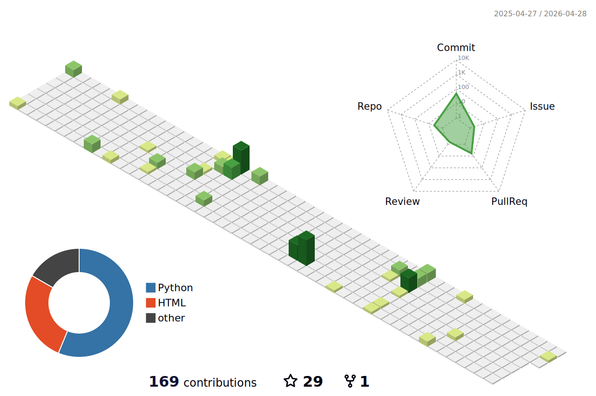
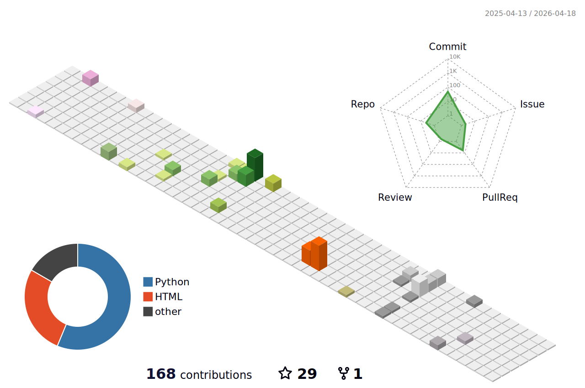

<!-- HEADER & TYPING SVG -->

<!-- SOCIALS -->

  
  
  
  
  
  
  

  

<!-- LEETCODE STATS (HIGHLIGHT) -->
<h2>🚀 LeetCode Status</h2>

<!--
THEME OPTIONS (Uncomment the one you like):
1. Dark (Current): theme=dark
2. Light: theme=light
3. Nord: theme=nord
4. Dracula: theme=dracula
5. Night Owl: theme=nightowl
-->

<!-- Advanced LeetCode Stats Card -->

  

<!-- GITHUB STATS -->
<h2>📊 GitHub Analytics</h2>

  <!--
  THEME OPTIONS:
  Replace 'bg_color=060B0D' and 'icon_color=F8D866' with standard themes like '&theme=dracula' or '&theme=radical'.
  -->

  <!-- GitHub Stats -->
  

  <!-- Top Languages -->
  

  <!-- Streak Stats -->
  

 

<!-- TECH STACK -->
<h2>🛠️ Tech Stack</h2>

  

 

<!-- VISUALIZATIONS -->
<h2>🐍 Contribution Snake</h2>
<!--
This snake animation is generated by the GitHub Action in .github/workflows/snake.yml
It updates automatically.
-->
<picture>
  <source media="(prefers-color-scheme: dark)" srcset="https://raw.githubusercontent.com/asterisk-ragavan/asterisk-ragavan/output/github-contribution-grid-snake-dark.svg">
  <source media="(prefers-color-scheme: light)" srcset="https://raw.githubusercontent.com/asterisk-ragavan/asterisk-ragavan/output/github-contribution-grid-snake.svg">
  
</picture>

  

<h2>🏙️ 3D Contribution City</h2>
<!--
This 3D city is generated by the GitHub Action in .github/workflows/profile-3d.yml
It updates automatically.

THEME OPTIONS (Uncomment the one you like):

1. Night Rainbow (Current)

2. Royal (Gold/Dark)
<!--  -->

3. Northern Lights (Cool Blue/Green)
<!--  -->

4. Green (Classic GitHub)
<!--  -->

5. Season (Changes with time)
<!--  -->
-->

  

<!-- BIO / PERSONAL -->

⚡ More About Me

 

- 🎓 **Education**: Bachelor of Engineering in Electronics and Communication.
- 🌱 **Learning**: Exploring Python, Data Analysis, and SQL.
- 👯 **Collaboration**: Looking to collaborate with content creators.
- 🥅 **2025 Goals**: Contribute to Open Source & master new languages.
- 🎨 **Fun Fact**: I love to draw (State-level award winner!) and play musical instruments.
- 🎧 **Music Taste**: Ed Sheeran, Eminem, Selena Gomez. *MJ - You're not alone.*

 

  

